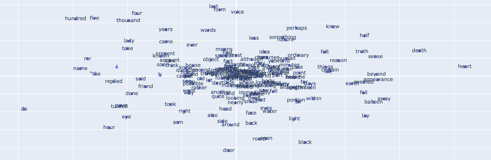
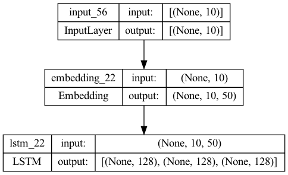
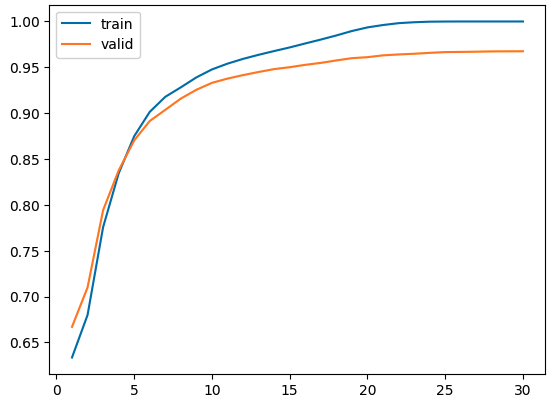

# Procesamiento del lenguaje Natual

## Trabajos prácticos

En el contexto de la carrera de Especialización en Inteligencia Artificial se dicta la materia Procesamiento del Lenguaje Natural. La misma consta de una parte práctica para la cual se desarrollan en total 6 trabajos.

Alumno: Ezequiel Fernández

### [Ejercicio 1](https://github.com/FIUBA-Posgrado-Inteligencia-Artificial/procesamiento_lenguaje_natural/blob/main/clase_1/ejercicios/1a%20-%20word2vec.ipynb)

Busca fortalecer los conceptos base de la materia. Dado un corpus chico, de propósito educativo, la idea es obtener diversos datos y representaciones del mismo. Primero se obtiene el vocabulario asociadod, luego la representación oneHotEncoding de los textos y los vectores de frecuencia para obtener después la matriiz TF-IDF.

Finalmente se implementan funciones que permiten comparar textos usando la similaridad coseno de sus representaciones, one hot encoding y tf-idf, obteniendo asi por ejemplo los dos textos mas similares del corpus.

[Resolución del ejercicio](https://github.com/ezequielfernandez/pln-practicas/blob/main/1a_word2vec.ipynb)

### [Ejercicio 2](https://github.com/FIUBA-Posgrado-Inteligencia-Artificial/procesamiento_lenguaje_natural/blob/main/clase_2/ejercicios/ejercicios.md)

En este problema se busca implementar un bot basado en reglas. El mismo se realiza en español, y tomando como lógica de negocio el contexto de un ecommerce.

Para la realización del mismo se hace un preprocesamiento de texto quitando caracteres especiales, acentos y números. Además se obtiene la lematización de cada token del corpus para simplificar la tarea del modelo.

También se quitan las stopwrds mediante nltk.

Para representar el problema se organizó al corpus como una lista de intents, donde cada intent tiene un tag (representación de la tematica que se esta tratando), patterns (textos de ejemplo que usa el usuario ante esta temática) y responses, respuestas típicas a esta temática.

Ejemplo:

`{"tag": "stock", "patterns": ["Esto está disponible", "¿Tenes stock?", "¿Hay stock hoy?", "¿Como se si hay stock?", "¿El producto se encuentra disponible?"], "responses": ["Si el producto se encuentra publicado, hay stock del mismo"] }`

A partir de esto se organizan los patterns como el X y las clases, que estan representados como tags, son el y a predecir.

Luego y se representa como un vector de clases multicategórico con one hot encoding.

Se implementa un modelo de red neuronal secuencial relativamente simple, con 17.675 parámetros entrenables

`Layer (type)                Output Shape              Param #`

`=================================================================`

`dense_12 (Dense)            (None, 128)               8704`

`dropout_8 (Dropout)         (None, 128)               0`

`dense_13 (Dense)            (None, 64)                8256`

`dropout_9 (Dropout)         (None, 64)                0`

`dense_14 (Dense)            (None, 11)                715`

`=================================================================`

`Total params: 17,675`

`Trainable params: 17,675`

`Non-trainable params: 0`

`_________________________________________________________________`

Se entrena al modelo por 300 epocas llegando a obtener un accuracy en train del 98,39%

Luego se prueba mediante interacción conmigo haciendo como si fuera un usuario de este hipotético ecommerce

`Hola! Q: Hola!`

`1/1 [==============================] - 0s 64ms/step`

`BOT: Hola, ¿Cómo estás?`

`Q: Todo bien, queria averiguar porque no me llego mi compra`

`1/1 [==============================] - 0s 36ms/step`

`BOT: Podes ver los detalles de tu envio en el siguiente link <link> allí podrás iniciar un reclamo si el envío está demorado`

`Q: Gracias!`

`1/1 [==============================] - 0s 23ms/step`

`BOT: ¡Por nada!, cualquier otra consulta podes escribirme`

`Q: Como puedo saber si hay stock de un producto?`

`1/1 [==============================] - 0s 24ms/step`

`BOT: Si el producto se encuentra publicado, hay stock del mismo`

`Q: Tengo un problema con una compra`

`1/1 [==============================] - 0s 39ms/step`

`BOT: En el siguiente link podrás encontrar tus compras y los detalles de las mismas <link>`

`Q: Gracias`

`1/1 [==============================] - 0s 25ms/step`

`BOT: ¡Por nada!, cualquier otra consulta podes escribirme`

`Q: Hacen envios a sucursales?`

`1/1 [==============================] - 0s 26ms/step`

`BOT: Tenemos diferentes formas de envios según la zona, te recomiendo entrar a este <link>`

`Q: Quiero calificar un producto`

`1/1 [==============================] - 0s 25ms/step`

`BOT: En el siguiente link podrás encontrar tus compras y calificar los productos <link>`

`Q: Quisiera saber cuales son los medios de pago`

`1/1 [==============================] - 0s 23ms/step`

`BOT: En el siguiente link podrás encontrar los beneficios y formas de pago vigentes`

`Q: Gracias!`

`1/1 [==============================] - 0s 40ms/step`

`BOT: ¡Por nada!, cualquier otra consulta podes escribirme`

`Q: Adios`

`1/1 [==============================] - 0s 23ms/step`

`BOT: Hasta luego!`

[Resolución del ejercicio](https://github.com/ezequielfernandez/pln-practicas/blob/main/bot_basado_en_reglas.ipynb)

### [Ejercicio 3](https://github.com/FIUBA-Posgrado-Inteligencia-Artificial/procesamiento_lenguaje_natural/blob/main/clase_3/ejercicios/ejercicios.md)

La idea es crear vectores usando Gensim utilizando algun dataset de interes.

En mi caso utilicé un dataset que contiene textos de Edgar Allan Poe. El mismo contiene las columnas

| **title** | **text** | **wikipedia_title** | **publication_date** | **first_published_in** | **classification** | **notes** | **normalized_date** |
| --------- | -------- | ------------------- | -------------------- | ---------------------- | ------------------ | --------- | ------------------- |

de las cuales yo me centré en text. En total disponía de 70 documentos.

Se aplicó un preprocesamiento a los mismos y la tokenización usando la función text_to_word_sequence de keras.preprocessing.text.

Para la generación de los vectores se usó el modelo Word2Vec y se lo entrenó por 250 epochs.

Luego se evalúa el espacio resultante haciendo diversas consultas.

`w2v_model.wv.most_similar(positive=["talking"], topn=10)`

`[('kickapoos', 0.5048884749412537),`

`('smith', 0.5003135204315186),`

`('zee', 0.47309809923171997),`

`('berry', 0.46835803985595703),`

`('vulgar', 0.46092313528060913),`

`('circulation', 0.4598088562488556),`

`('zit', 0.4446318745613098),`

`('lose', 0.4442058503627777),`

`('brigadier', 0.4411779046058655),`

`('frog', 0.4302944839000702)]`

En este caso para mysteries se ve cierta relación con los textos que suele escribir el autor.

`w2v_model.wv.most_similar(positive=["mysteries"], topn=10)`

`[('vestibule', 0.4618210196495056),`

`('hearts', 0.4575481712818146),`

`('divine', 0.4533630609512329),`

`('discoursed', 0.4512646496295929),`

`('you’re', 0.4496985673904419),`

`('anon', 0.4460476040840149),`

`('existing', 0.43353918194770813),`

`('precincts', 0.43256255984306335),`

`('notwithstanding', 0.4293864369392395),`

`('share', 0.4274493455886841)]`

También analizamos el término tumba, en inglés grave

`w2v_model.wv.most_similar(positive=["grave"], topn=10)`

`[('moon', 0.4588015079498291),`

`('lady', 0.4418303966522217),`

`('valve', 0.4406658709049225),`

`('closer', 0.4287431538105011),`

`('building', 0.4040292501449585),`

`('appointed', 0.40371987223625183),`

`('gallant', 0.39902758598327637),`

`('sincerity', 0.3985688388347626),`

`('slumbering', 0.3969342112541199),`

`('examination', 0.3893827199935913)]`

Y terror

`w2v_model.wv.most_similar(positive=["terror"], topn=10)`

`[('horror', 0.5143254399299622),`

`('uttered', 0.45540472865104675),`

`('awakening', 0.4247720241546631),`

`('assembly', 0.4208236038684845),`

`('reverie', 0.4161911606788635),`

`('bewildering', 0.4097308814525604),`

`('echoes', 0.40951940417289734),`

`('overpowered', 0.40647971630096436),`

`('conceptions', 0.40567708015441895),`

`('abeyance', 0.4030711054801941)]`

Por último mediante PCA se redujeron dimensiones del espacio latente para hacer una gráfica 2D de las palabras y su similitud en dicho espacio.

Vemos algunas relaciones que tienen sentido, como door cerca de room, head cerca de face, eyes, feet. Room y open aparecen casi en el mismo lugar. Podemos ver que death esta relativamente cerca de heart. Vemos que alone esta cerca de appeared, still.

Se ven ejemplos donde se efectiviza el paradigma del escritor, cuyos textos son de terror, suspenso y misterio

[Resolución del ejercicio](https://colab.research.google.com/drive/1jB3Wgns_NXyvbNHDmfVqJNzcRQUlmprj#scrollTo=JYTXvqScCEtb)

### [Ejercicio 4](https://github.com/FIUBA-Posgrado-Inteligencia-Artificial/procesamiento_lenguaje_natural/blob/main/clase_4/ejercicios/ejercicios.md)

Se busca poner en práctica la predicción de la próxima palabra. Para esto se usaron dos datasets, uno de [diálogos de Los Simpsons](https://www.kaggle.com/datasets/pierremegret/dialogue-lines-of-the-simpsons/code) y otro de [noticias financieras de Estados Unidos](https://www.kaggle.com/datasets/miguelaenlle/massive-stock-news-analysis-db-for-nlpbacktests?select=raw_analyst_ratings.csv)

#### Diálogos de Los Simpsons

En este caso me quedé con los diálogos de Homero Simpson. Contaba con un total de 27850 textos. Utilicé una longitud de 5, por lo que se debia predecir la quinta palabra dadas cuatro anteriores. Se usó text_to_word_sequence para tokenizar y texts_to_sequences para convertir a números las palabras. En total habia 272659 rows en el dataset.

Se construyó un modelo secuencial como se muestra:

`model **=** Sequential()`

`model**.**add(LSTM(128, return_sequences**=True**))`

`model**.**add(Dropout(0.2)) model**.**add(LSTM(64, return_sequences**=True**))`

`model**.**add(Dropout(0.2)) model**.**add(LSTM(128, return_sequences**=True**))`

`model**.**add(Dropout(0.2)) model**.**add(LSTM(64, return_sequences**=True**))`

`model**.**add(Dropout(0.2)) model**.**add(LSTM(32))`

`model**.**add(Dense(32, activation**=**'sigmoid')`

`model**.**add(Dense(vocab_size, activation**=**'softmax'))`

`model**.**compile(loss**=**'categorical_crossentropy', optimizer**=**'adam', metrics**=**['accuracy'])`

Quedando 886.957 parámetros entrenables.

Luego de entrenar por 50 epochs se ve que el modelo empieza a converger, los valores de accuracy son muy bajos.

Se definieron funciones para obtener la respuesta del modelo y concatenarla a la entrada del usuario, y otra para generar una secuencia a partir de una entrada del usuario usando al modelo para concatenar palabras, y se realizaron pruebas.

input_text**\=**'it is friday' generate_seq(model, tok, input_text, max_length\*\*=**4, n_words**\=\*\*1)

1/1 \[==============================\] - 0s 24ms/step

Out\[68\]:

'it is friday my'

input_text**\=**'I work hard for' generate_seq(model, tok, input_text, max_length\*\*=**4, n_words**\=\*\*1)

1/1 \[==============================\] - 0s 29ms/step

Out\[69\]:

'I work hard for i'

input_text**\=**'Give me a beer' generate_seq(model, tok, input_text, max_length\*\*=**4, n_words**\=\*\*1)

1/1 \[==============================\] - 0s 31ms/step

Out\[70\]:

'Give me a beer to'

input_text**\=**'What are you doing' generate_seq(model, tok, input_text, max_length\*\*=**4, n_words**\=\*\*1)

1/1 \[==============================\] - 0s 34ms/step

Out\[71\]:

'What are you doing a'

input_text**\=**'what do you think about' generate_seq(model, tok, input_text, max_length\*\*=**4, n_words**\=\*\*1)

1/1 \[==============================\] - 0s 42ms/step

Out\[83\]:

'what do you think about i'

input_text**\=**'why my son is so' generate_seq(model, tok, input_text, max_length\*\*=**4, n_words**\=\*\*1)

1/1 \[==============================\] - 0s 22ms/step

Out\[84\]:

'why my son is so gotta'

input_text**\=**'Lenny and' generate_seq(model, tok, input_text, max_length\*\*=**4, n_words**\=\*\*1)

1/1 \[==============================\] - 0s 124ms/step

Out\[90\]:

'Lenny and you'

#### Dataset de noticias

Consiste de las columnas

| **headline** | **url** | **publisher** | **date** | **stock** |
| ------------ | ------- | ------------- | -------- | --------- |

Y me quede con headline que representa al título de las noticias. En este caso tenia 1407328 textos y utilicé un largo de secuencia de 3.

Definí un modelo secuencial como sigue:

`model **=** Sequential()`

`model**.**add(Embedding(input_dim**=**vocab_size**+**1, output_dim**=**7, input_length**=**input_seq_len))`

`model**.**add(LSTM(64, return_sequences**=True**)) model**.**add(Dropout(0.2))`

`model**.**add(LSTM(64, return_sequences**=True**)) model**.**add(Dropout(0.2))`

`model**.**add(LSTM(128, return_sequences**=True**))`

`model**.**add(Dropout(0.2))`

`model**.**add(LSTM(128, return_sequences**=True**))`

`model**.**add(Dropout(0.2)) model**.**add(LSTM(64))`

`model**.**add(Dense(32, activation**=**'sigmoid'))`

`model**.**add(Dense(vocab_size, activation**=**'softmax'))`

`model**.**compile(loss**=**'categorical_crossentropy', optimizer**=**'adam', metrics**=**['accuracy'])`

Queddando 574.591 parámetros entrenables. Luego de 200 epochs desaceleró la mejora en accuracy, quedando la gráfica como sigue:

Se ve una mejora en entrenamiento respecto al caso de Los Simpsons.

Usando las dos funciones mencionadas anteriormente se probó al modelo.

input_text**\=**'President barak' generate_seq(model, tok, input_text, max_length\*\*=**2, n_words**\=\*\*1)

1/1 \[==============================\] - 0s 93ms/step

Out\[52\]:

'President barak announces'

input_text**\=**'President barak' generate_seq(model, tok, input_text, max_length\*\*=**2, n_words**\=\*\*5)

1/1 \[==============================\] - 0s 82ms/step 1/1 \[==============================\] - 0s 41ms/step 1/1 \[==============================\] - 0s 33ms/step 1/1 \[==============================\] - 0s 21ms/step 1/1 \[==============================\] - 0s 37ms/step

Out\[32\]:

'President barak announces earnings buffett falls fund'

input_text**\=**'Minister say' generate_seq(model, tok, input_text, max_length\*\*=**2, n_words**\=\*\*5)

1/1 \[==============================\] - 0s 49ms/step 1/1 \[==============================\] - 0s 49ms/step 1/1 \[==============================\] - 0s 33ms/step 1/1 \[==============================\] - 0s 20ms/step 1/1 \[==============================\] - 0s 21ms/step

Out\[33\]:

'Minister say toyota just on morgan stocks'

input_text**\=**'Covid was' generate_seq(model, tok, input_text, max_length\*\*=**2, n_words**\=\*\*5)

1/1 \[==============================\] - 0s 25ms/step 1/1 \[==============================\] - 0s 75ms/step 1/1 \[==============================\] - 0s 22ms/step 1/1 \[==============================\] - 0s 21ms/step 1/1 \[==============================\] - 0s 32ms/step

Out\[34\]:

'Covid was europe the steel day in'

input_text**\=**'russia china' generate_seq(model, tok, input_text, max_length\*\*=**2, n_words**\=\*\*5)

1/1 \[==============================\] - 0s 61ms/step 1/1 \[==============================\] - 0s 95ms/step 1/1 \[==============================\] - 0s 31ms/step 1/1 \[==============================\] - 0s 26ms/step 1/1 \[==============================\] - 0s 20ms/step

Out\[47\]:

'russia china companies for close are for'

input_text**\=**'russia ukraine' generate_seq(model, tok, input_text, max_length\*\*=**2, n_words**\=\*\*3)

1/1 \[==============================\] - 0s 88ms/step 1/1 \[==============================\] - 0s 41ms/step 1/1 \[==============================\] - 0s 171ms/step

Out\[51\]:

'russia ukraine law upstream sectors'

input_text**\=**'russia cuba' generate_seq(model, tok, input_text, max_length\*\*=**2, n_words**\=\*\*1)

1/1 \[==============================\] - 0s 40ms/step

Out\[49\]:

'russia cuba europe'

Si bien los resultados son pobres, considero que en este último caso se produjeron predicciones mas asertivas.

[Resolución del ejercicio](https://github.com/ezequielfernandez/pln-practicas/tree/main/next_word_prediction)

### [Ejercicio 5](https://github.com/FIUBA-Posgrado-Inteligencia-Artificial/procesamiento_lenguaje_natural/blob/main/clase_5/ejercicios/ejercicios.md)

La idea del mismo es utilizar Embeddings + LSTM para clasificar críticas de compradores de ropa.

El dataset utilizado dispone del texto del review y su rating sobre el producto, que puede ser entre 0 y 4 estrellas, y se encuentra considerablemente desbalanceado

Se plantearon diversas estrategias para balancear el mismo y se entrenaron modelos para evaluar resultados.

En particular se trabajó con el dataset simplificado: las clases 0, 1 y 2 se uniferon bajo una misma clase que engloba a todas las malas, luego quedan la 3 y 4, quedando un desbalance mucho mas sano para un modelo, sin embargo el desbalance sigue siendo considerable y el problema se simplificó mucho por lo que solo se utilizará para evaluar y comparar.

Se alcanzó un 55% de accuracy en train y en validación hubo oscilaciones entre 40 y 75%

No distó mucho del entrenamiento con los datos originales

También se entrenaron modelos considerando la misma cantidad de ejemplos en todas las clases tomando como referencia la clase minoritaria, que eran 821, alcanzando un 25% de accuracy en train

Otra prueba fue cortando por la clase 2, que tiene 2823 ejemplos, alcanzando un 25% de accuracy en train

Se probaron diversas arquitecturas hasta que me quede con una que mostró un mejor entrenamiento: descenso de loss y aumento de acc

\==========================================================================================

Layer (type:depth-idx)                   Output Shape              Param #

\==========================================================================================

Model4                                   \[1, 5\]                    --

├─Embedding: 1-1                         \[1, 115, 50\]              200,050

├─LSTM: 1-2                              \[1, 115, 64\]              62,976

├─Linear: 1-3                            \[1, 128\]                  8,320

├─Sigmoid: 1-4                           \[1, 128\]                  --

├─Dropout: 1-5                           \[1, 128\]                  --

├─Linear: 1-6                            \[1, 256\]                  33,024

├─Sigmoid: 1-7                           \[1, 256\]                  --

├─Dropout: 1-8                           \[1, 256\]                  --

├─Linear: 1-9                            \[1, 5\]                    1,285

├─Softmax: 1-10                          \[1, 5\]                    --

\==========================================================================================

Total params: 305,655

Con este modelo llegamos a un mejor comportamiento:

Luego se hizo un preprocesamiento particular para balancear las clases.

Por un lado se quitaron stopwords usando nltk y por el otro tomé de internet una [lista de palabras en inngles con connotación negativa.](https://ptrckprry.com/course/ssd/data/negative-words.txt)

Definí una función que dada unna clase, obtiene las n palabras negativas mas usadas en dicha clase ordenadas por su frecuencia.

Luego para cada clase cuyo rating sea malo (esto es, rating 0, 1 y 2, que son las clases minoritarias) agregué ejemplos siguiendo la estrategia de recorrer rows y usar cada ejemplo para contruir uno nuevo, cambiando palabras negativas del mismo, reemplazandolas por una palabra random negativa de las 100 palabras negativas mas usadas de su clase.

Con esta estrategia empareje las class 0 a 3, quedando entre 4500 y 4908 ejemplos. La clase 5 tiene 12540 ejemplos y lo que se hizo fue acotarla a 6000.

Con este dataset se entrenó al modelo por 200 epochs llegando a un accuracy de train de 85% y un accuracy de validación oscilando entre 50% y 80%

Y se probó con algunas reviews creadas por mi u obtenidas de Amazon

predict_rating(model2, tok, "the chacket is amazing, made me looks great")

tensor(4)

predict_rating(model2, tok, "the shirt is not cute, I look terribly using it. The color is not as the picture, I wish light blue but is dark. Buy this was a bad idea")

tensor(2)

predict_rating(model2, tok, "It is the better chacket I ever see in my life")

tensor(3)

From Amazon, rating 2

predict_rating(model2, tok, "I received the XL shirt (which is the size of my other shirts) and really was unimpressed. The short is a linen/cotton blend but the material felt rather stiff and thick. The black was a good deep shade but the sizing felt off – not wrong around the body but the arms were longer than expected the cuffs gaping and this would make me say that on the product pictures this might be why all show the sleeves rolled up. Or maybe it is because of the lop-sided arms… Not mine, my arms are not lopsided but the left sleeve rode down to cover over the base of the back of my hand, the right went all the way to my fingers – I hope I just got a randomly misshaped one and this is not the norm, but for me, not great.")

tensor(3)

From Amazon, rating 4

predict_rating(model2, tok, "This cotton linen long sleeve men 's casual shirt is very suitable for wearing in daily life and work, very comfortable and breathable. My husband usually wears the S model, because he likes to wear a little loose, I ordered this L, which is a really soft cotton and linen material, feels very comfortable, and presents his body perfectly. He likes to wear this men 's cotton and linen long-sleeved business shirt, I also like him to wear this cotton and linen shirt, no smell and itching and take care of very convenient, will not appear color and shrinkage of the situation, the seam is also very in place, no extra thread.I highly recommend this long-sleeved linen shirt for men. My husband told me it was the best gift he ever received and he was very happy.")

tensor(4)

### [Ejercicio 6](https://github.com/FIUBA-Posgrado-Inteligencia-Artificial/procesamiento_lenguaje_natural/tree/main/clase_6/ejercicios)

Se entrena un modelo cuyo objetivo es implementar un QA bot. Para esto se usa un modelo encoder-decoder.

#### Configuración:

- MAX_VOCAB_SIZE = 8000
- max_length = 10
- Embeddings 300 Fasttext
- n_units = 256, pero se probó también con 128
- LSTM Dropout 0.2
- Epochs 50

Para dicho bot se usó un mismo tokenizer tanto para la entrada del encoder como para la entrada del decoder. Para el fit del mismo se usaron las sentencias de input, de output y los ítems y que representan el inicio y fin de una oración.

La cantidad de parámetros entrenables del modelo fue de 2.054.584, este número se incrementó notoriamente al cambiar n_units de 128 a 256. Este cambio se hizo con la esperanza de que el modelo se comporte mejor en las pruebas manuales.

Vemos como queda la arquitectura del modelo:  

Luego de entrenar al modelo por 50 epochs se llegó a un accuracy en train del 100% y en validación del 96,69%.

A continuación vemos una gráfica del accuracy durante las epocas del entrenamiento.

Estos valores altos se alcanzaban con pocas epochs y también con 128 n_units, sin embargo las respuestas del bot no fueron muy robustas. A continuación dejo algunos ejemplos:

Input: yes i like to play football  
Response: wrong wrong wrong wrong wrong wrong wrong

Input: Hello bot how are you?  
Response: contour contour contour contour contour allergy allergy allergy

Input: Do you read?  
Response: alwar alwar alwar alwar

Input: Do you have any pet?  
Response: wrong wrong wrong wrong wrong

Input: What is your name?  
Response: whatever whatever whatever whatever

Input: Where are you from?  
Response: whatever whatever whatever whatever

Input: Who is the best of the world?  
Response: gob gob gob gob gob gob

[Resolución del ejercicio](https://github.com/ezequielfernandez/pln-practicas/blob/main/conversational_bot/bot_with_encoder_decoder.ipynb)
